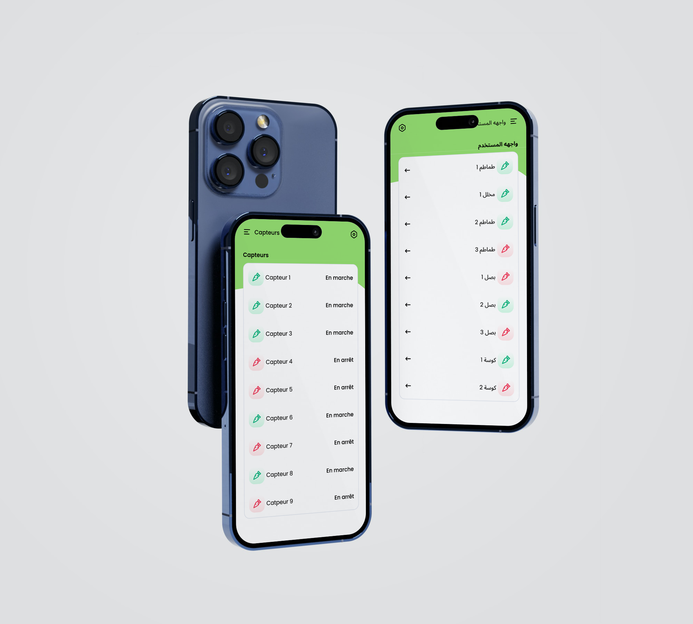

# ALIVEcode Mobile

https://github.com/user-attachments/assets/fd1bef97-1078-4047-955a-5ee9764073af

This mobile app is a portal to the insight data given by the sensors of the [ALIVEculture](https://aliveculture.ca/) initiative; whom attempt to build a real-time agricultural monitoring tool and create smart, connected greenhouses.

## Features

- Greenhouses Management
- See all of a sensor's data as a table or a graphic:
  - Ground Temperature
  - Air Temperature
  - Ground Humidity
  - Air Humidity
  - Luminosity
  - Remaining battery
